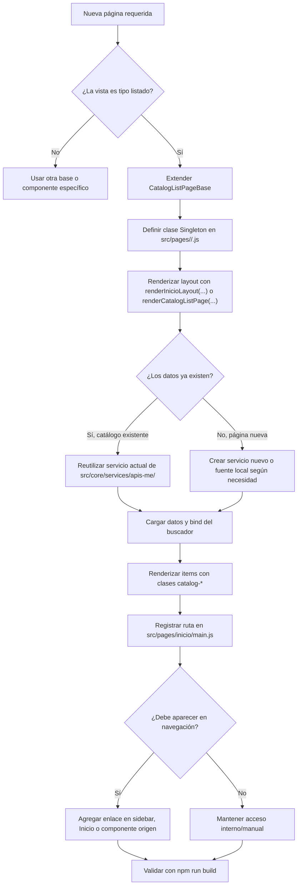
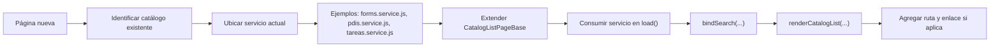
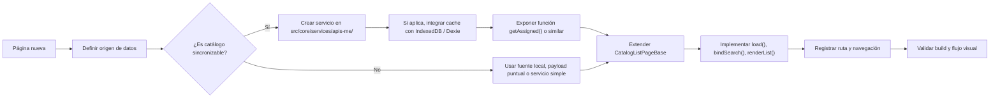
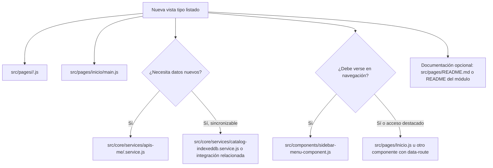
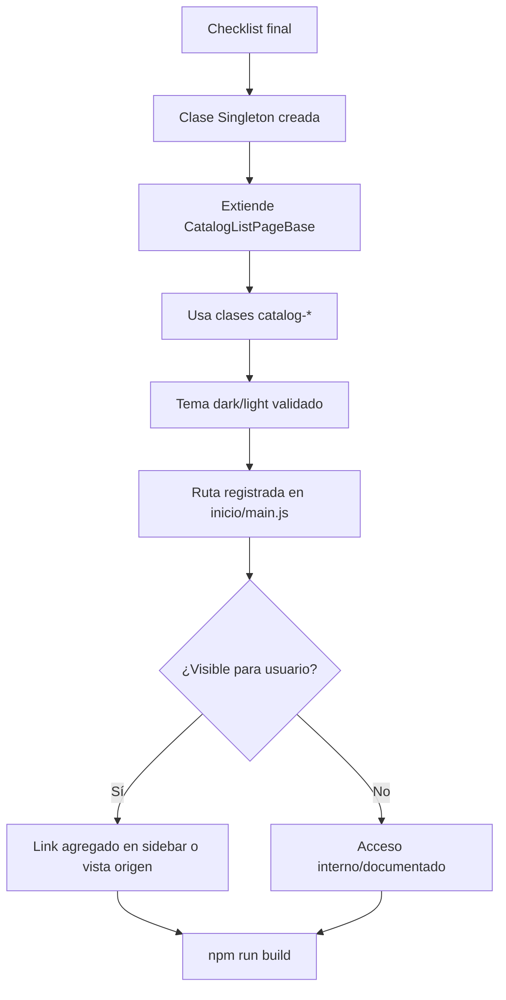

# Flujo de creación de páginas con `CatalogListPageBase`

Esta guía documenta cómo crear una nueva página usando el patrón compartido de listados basado en:

- `src/pages/shared/catalog-list-page.base.js`
- `src/pages/inicio-layout.js`
- tokens de tema definidos en `src/styles/themes.css`

Aplica para páginas con esta estructura:

- título
- subtítulo opcional
- buscador
- barra de columnas
- contenido en lista

---

## Diagrama general



---

## Escenario 1: página con catálogo existente



### Cuándo usar este camino

- Ya existe un servicio en `src/core/services/apis-me/`.
- El catálogo ya se sincroniza o se consulta actualmente.
- Sólo necesitas una nueva vista para leer, filtrar o navegar ese contenido.

### Ejemplo real

- `src/pages/puntosInteres/PuntosInteres.js`
- `src/core/services/apis-me/pdis.service.js`

---

## Escenario 2: página nueva con datos nuevos



### Cuándo usar este camino

- No existe todavía el servicio.
- La fuente de datos es nueva.
- La nueva pantalla necesita incorporarse al flujo del proyecto.

### Consideraciones que suelen faltar

- Si el dato es reutilizable, crear servicio en `src/core/services/` o `src/core/services/apis-me/`.
- Si usa APIs del navegador con potencial de reuso, centralizarlas en `src/core/services/` con patrón Singleton.
- Si será un catálogo oficial del frontend, revisar si debe integrarse con IndexedDB según `src/core/services/CATALOG_STORAGE_INDEXEDDB.md`.
- Si la página requiere acceso autenticado, registrar la ruta con `meta.requiresAuth: true`.

---

## Diagrama de archivos a tocar



---

## Estructura base recomendada

```js
import { CatalogListPageBase } from '../shared/catalog-list-page.base.js';
import { getAssignedFeature } from '../../core/services/apis-me/feature.service.js';

export default class MiPagina extends CatalogListPageBase {
  static instancia = null;

  constructor() {
    if (MiPagina.instancia) {
      return MiPagina.instancia;
    }

    super();
    this.allItems = [];
    MiPagina.instancia = this;
  }

  async inicializar(container) {
    if (container) {
      this.render(container);
    }

    return this;
  }

  render(container) {
    this.renderCatalogListPage(container, {
      title: 'Mi página',
      description: 'Descripción breve.',
      searchPlaceholder: 'Buscar por nombre',
      searchInputId: 'featureSearchInput',
      stateContainerId: 'featureStateContainer'
    });

    this.bindCatalogMobileSearchToggle(container);
    this.bindSearch(container);
    this.loadItems(container);
  }
}
```

---

## Alta manual de la ruta

Archivo:

- `src/pages/inicio/main.js`

Pasos:

1. Importar la nueva página al inicio del archivo.
2. Registrar la ruta con `registerRoute(...)`.
3. Definir `meta.title`.
4. Marcar `meta.requiresAuth: true` si la vista es privada.

Ejemplo:

```js
import MiPagina from '../miModulo/MiPagina.js';

registerRoute('/mi-pagina', MiPagina, {
  meta: { title: 'Mi página', requiresAuth: true }
});
```

### Reglas prácticas de ruta

- Usar rutas hash tipo `#/mi-pagina`.
- Mantener slug corto, estable y en minúsculas.
- Si habrá detalle, usar patrón `/:id` o `/:indicator` sólo cuando realmente exista una entidad identificable.

---

## Cómo hacer navegable la página

Registrar la ruta no siempre la hace visible al usuario. Si debe aparecer en navegación:

### Sidebar

Archivo:

- `src/components/sidebar-menu-component.js`

Agregar item en `get items()` o en la sección correspondiente:

```js
{ path: '/mi-pagina', label: 'Mi página', icon: 'list' }
```

### Acceso desde Inicio u otra vista

Archivos comunes:

- `src/pages/Inicio.js`
- componentes con enlaces `data-route`

Ejemplo:

```html
<a href="#/mi-pagina" data-route="/mi-pagina">Ir a mi página</a>
```

---

## Checklist mínimo



---

## Referencias actuales

- Base compartida: `src/pages/shared/catalog-list-page.base.js`
- Referencia simple: `src/pages/puntosInteres/PuntosInteres.js`
- Referencia con tema por item: `src/pages/formularios/formularios.js`
- Registro de rutas: `src/pages/inicio/main.js`
- Router: `src/core/router.js`
- Documentación del router: `src/core/ROUTER.md`
